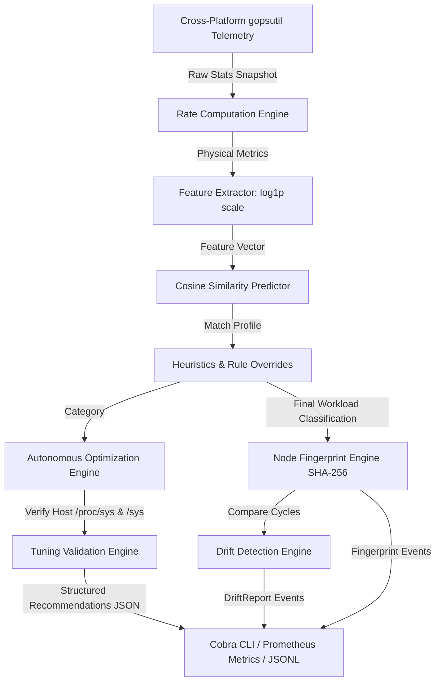

# proc-lens: Universal Process Intelligence and HLD Workload Classifier

> **Note**: proc-lens is a production-grade, zero-ML-dependency process intelligence agent written in Go. It occupies a niche that no existing tool fills completely: *semantic workload understanding + validated kernel tuning + fleet-wide fingerprinting + workload drift detection*, delivered in a single statically-linked binary with a strictly least-privilege security model.

---

## Why proc-lens? — The Unique Selling Points

No other lightweight edge agent combines all of the following. This section explains why.

### USP 1 — Semantic HLD Workload Classification (Zero ML, Sub-10µs, 16 Archetypes)

Most monitoring tools tell you **how much** resource a process consumes. proc-lens tells you **what architectural role** that process is playing.

Every running process is classified into one of 16 High-Level Design (HLD) architecture archetypes:

| Archetype | Examples |
|---|---|
| `LoadBalancer` | Envoy, HAProxy, Nginx (frontend) |
| `WebServer` | Apache, Caddy, Node.js backend |
| `CacheStore` | Redis, Memcached |
| `RelationalDB` | PostgreSQL, MySQL, CockroachDB |
| `NoSQLDB` | MongoDB, Cassandra |
| `ColumnarDB` | ClickHouse, DuckDB |
| `VectorDB` | Milvus, Qdrant, Pinecone |
| `SearchEngine` | Elasticsearch, OpenSearch |
| `MessageBroker` | RabbitMQ, NATS |
| `EventStreaming` | Kafka, Pulsar |
| `AITraining` | PyTorch Training, TensorFlow |
| `AIInference` | Triton Inference Server, TF Serving |
| `OrchestratorAgent` | Kubelet, Containerd |
| `MonitoringAgent` | Prometheus, Datadog Agent, OpenTelemetry |
| `InteractiveShell` | Bash, SSH session, systemd |
| `UtilityBatch` | Compilers, compression tools (gzip) |

The classifier uses a **logarithmic cosine similarity model** (log1p-scaled features against archetype centroid vectors) combined with name/cmdline heuristic boosters. No Python runtime, no TensorFlow, no ONNX — just pure Go math running in sub-10 microseconds per process.

**Why no other tool does this**: node_exporter, Telegraf, osquery, and cAdvisor give you raw counters. Parca and Falco give you deep profiling/security at the kernel level. None of them answer "is this process a database or a load balancer?" out of the box.

---

### USP 2 — Node Workload Fingerprint (Unique to proc-lens)

Every scan cycle, proc-lens computes a **stable SHA-256 fingerprint** of the node's workload category distribution. This is a genuine first in the lightweight edge-agent space.

```
[Node Fingerprint] 3a7f2c9b1e4d8f06...  |  Profile: RelationalDB (dominant) + CacheStore (heavy)  |  Diversity: 0.43
```

**What makes it unique:**
- Two nodes with the same workload mix produce the **same fingerprint** — enabling fleet-wide comparison without central coordination.
- A change in fingerprint signals a meaningful **architectural shift** on the node, not just a noisy metric spike.
- The fingerprint is emitted as a structured JSONL event (`event_type: "node_fingerprint"`) for ingestion by Loki, Elasticsearch, Splunk, or any log aggregator.
- Includes a **Shannon entropy diversity score** [0.0–1.0] indicating how mixed the workload is.

**Positioning**: "Before proc-lens, you had to look at 15 different Grafana panels to understand what kind of node this is. Now you have a single hash."

---

### USP 3 — Workload Drift Detection (Unique to proc-lens)

When the workload mix on a node changes significantly between scan cycles, proc-lens **detects, classifies, and emits a structured drift event** with severity (INFO / WARN / CRITICAL).

```json
{
  "event_type": "workload_drift",
  "severity": "CRITICAL",
  "fingerprint_changed": true,
  "max_delta_pct": 38.5,
  "summary": "AITraining workloads appeared on this node (now 38.5% of classified processes)",
  "changes": [
    {"category": "AITraining", "previous_pct": 0, "current_pct": 38.5, "direction": "appeared"},
    {"category": "UtilityBatch", "previous_pct": 45.0, "current_pct": 6.5, "direction": "decreased"}
  ]
}
```

**Why this matters**: A node_exporter alert tells you "CPU is at 90%". The drift engine tells you *why* in architecture terms and gives you a starting point for investigation — before you even open a ticket.

**Threshold**: Changes of less than 5 percentage points are intentionally ignored to prevent noise in environments with many short-lived processes.

---

### USP 4 — Validated, Safe Kernel Optimization (Live /proc/sys Verification)

proc-lens does not blindly suggest `sysctl -w ...` commands. It **reads the live kernel parameter value** from `/proc/sys` and marks each recommendation as:

- `[ALREADY APPLIED]` — The kernel parameter already meets or exceeds the recommendation. No action required.
- `[PENDING]` — The recommendation has not yet been applied.
- `[NOT APPLICABLE]` — This check does not apply to the current platform (Windows/macOS).

This is far safer than static tuning scripts (which may over-write already-correct values) and far more actionable than generic tuning guides.

---

### USP 5 — Structured Machine-Readable Recommendations (GitOps-Friendly)

Every optimization recommendation is a first-class JSON object with:

```json
{
  "key": "vm.dirty_background_ratio",
  "category": "RelationalDB",
  "description": "Controls when kernel background threads start flushing dirty pages...",
  "recommended_command": "sysctl -w vm.dirty_background_ratio=5",
  "current_value": "20",
  "recommended_value": "5",
  "apply_status": "PENDING",
  "risk": "LOW",
  "confidence": "HIGH",
  "tags": ["kernel", "storage", "database", "io"]
}
```

**Why this matters**: These can be consumed by Ansible, Kyverno, OPA, or custom Kubernetes operators to propose or apply tuning changes in a GitOps pipeline. No other lightweight node agent produces this level of machine-readable, risk-graded, programmatically actionable tuning output natively.

---

### USP 6 — Ultra-Low-Privilege Security Model

proc-lens is designed from the ground up to be the **least-privileged node agent** in its class:

| Control | proc-lens | Typical eBPF Agent | Typical Commercial Agent |
|---|---|---|---|
| Runs as root | ❌ Never | ✅ Often | ✅ Often |
| Privileged container | ❌ Never | ✅ Often | ⚠️ Sometimes |
| Capabilities required | `CAP_SYS_PTRACE` only | `CAP_BPF` + `CAP_SYS_ADMIN` + more | Varies (often broad) |
| Read-only root filesystem | ✅ Yes | ❌ Rarely | ❌ Rarely |
| hostNetwork | ❌ Disabled | ⚠️ Sometimes | ⚠️ Sometimes |
| Cmdline redaction | ✅ Default | ❌ No | ⚠️ Opt-in |
| Air-gap capable | ✅ Full local mode | ❌ Requires kernel headers | ❌ Requires cloud |

This makes proc-lens the easiest node agent to get approved in regulated environments, high-security clusters, and environments where eBPF tools with broad capabilities face review friction.

---

### USP 7 — Platform Capability Transparency (`capabilities` subcommand)

```bash
./proc-lens capabilities
```

Produces an honest, machine-readable report of exactly which features are FULL / PARTIAL / UNAVAILABLE on the current platform. No other edge agent provides this level of runtime self-description.

```
[Feature Detail]
  Process Telemetry Collection         ✓ FULL
  HLD Workload Classification          ✓ FULL
  Node Workload Fingerprint            ✓ FULL
  Workload Drift Detection             ✓ FULL
  Disk I/O Rate Telemetry              ✓ FULL          (Linux only)
  Kernel Parameter Validation          ✓ FULL          (Linux only)
  Structured Machine-Readable Recs     ✓ FULL          (Linux only)
  Cgroup v1/v2 + K8s Metadata          ✓ FULL          (Linux only)
  Prometheus Metrics Export            ✓ FULL
  Command-Line Redaction               ✓ FULL
  LLM Enrichment (enrich)             ✓ FULL
```

---

### USP 8 — True Dual-Use Binary (Laptop + Production Fleet + CI)

The same binary works everywhere:

| Use Case | Command |
|---|---|
| Developer laptop (macOS/Windows) | `./proc-lens scan -c 0.1 -m 5.0` |
| Live process deep-dive | `./proc-lens analyze --pid 1234 --duration 2s` |
| Profile a new service before deploying | `./proc-lens run --cmd "gunicorn app:main" --duration 5s` |
| Get an AI-generated SRE report | `./proc-lens enrich --top 5` |
| Production K8s DaemonSet (JSONL to Loki) | `./proc-lens scan --loop --format json` |
| CI pipeline workload check | `./proc-lens scan --format json \| jq '.primary_category'` |

No other agent is equally optimised for all six of these workflows without configuration changes.

---

### USP 9 — Optional LLM Enrichment with Explicit Security Gates

The `enrich` subcommand collects classified process telemetry and optionally sends a small, high-signal payload to a frontier LLM (Gemini, Claude, Grok, OpenAI, or local Ollama) for SRE narrative generation.

**Security gates** (unique in this space):
- `--allow-remote-llm` flag is **mandatory** for non-local LLM providers. No accidental data exfiltration.
- Local Ollama (`localhost` / `127.0.0.1`) works without the flag.
- When running inside a container with `HOST_PROC` set, a warning is logged.
- Cmdline arguments are redacted **before** the payload is assembled (no secrets sent to LLMs by default).

---

### USP 10 — Low-Cardinality, Self-Observing Prometheus Metrics

proc-lens exports 11 carefully designed, **low-cardinality** Prometheus metrics. Labels use category strings only — no per-PID or per-process labels that would cause cardinality explosion in production.

| Metric | Type | Purpose |
|---|---|---|
| `proc_intel_scans_total` | Counter | Scan cycles completed |
| `proc_intel_collection_errors_total` | Counter | Errors by reason |
| `proc_intel_processes_classified_total` | Counter | Cumulative classifications by category |
| `proc_intel_processes_scanned` | Gauge | PIDs discovered last cycle |
| `proc_intel_predictions` | Gauge | Current counts by category |
| `proc_intel_agent_cpu_usage_percent` | Gauge | Agent's own CPU usage |
| `proc_intel_agent_memory_rss_bytes` | Gauge | Agent's own RSS memory |
| `proc_intel_k8s_metadata_success_rate` | Gauge | Pod metadata resolution rate |
| `proc_intel_collection_duration_seconds` | Histogram | Full cycle duration |
| `proc_intel_per_process_collection_seconds` | Histogram | Per-PID collection cost |
| `proc_intel_k8s_metadata_enrichment_total` | Counter | K8s metadata attempts |

**FinOps use case**: Feed `proc_intel_predictions{category="RelationalDB"}` into OpenCost or Kubecost to explain why these nodes have high IOPS costs.

---

## Comparison Matrix: proc-lens vs Peers

| Feature | proc-lens | node_exporter | Parca | Falco | Tetragon | Coroot | osquery | Telegraf |
|---|:---:|:---:|:---:|:---:|:---:|:---:|:---:|:---:|
| **HLD Semantic Classification** | ✅ 16 archetypes | ❌ | ❌ | ❌ | ❌ | ⚠️ Partial | ❌ | ❌ |
| **Node Workload Fingerprint** | ✅ SHA-256 | ❌ | ❌ | ❌ | ❌ | ❌ | ❌ | ❌ |
| **Workload Drift Detection** | ✅ Structured events | ❌ | ❌ | ⚠️ Rule-based | ⚠️ Rule-based | ❌ | ❌ | ❌ |
| **Validated Kernel Tuning** | ✅ Live /proc/sys | ❌ | ❌ | ❌ | ❌ | ❌ | ❌ | ❌ |
| **Machine-Readable Recommendations** | ✅ JSON + Risk + Confidence | ❌ | ❌ | ❌ | ❌ | ❌ | ❌ | ❌ |
| **Cmdline Redaction (Default)** | ✅ | ❌ | ❌ | ❌ | ❌ | ❌ | ❌ | ❌ |
| **Air-Gap Capable** | ✅ Full local mode | ✅ | ✅ | ⚠️ Partial | ⚠️ Partial | ❌ | ✅ | ✅ |
| **Capabilities Required** | `PTRACE` only | None | `BPF` etc | `BPF`/module | `BPF`/module | `BPF` etc | None | None |
| **LLM Enrichment (Gated)** | ✅ | ❌ | ❌ | ❌ | ❌ | ⚠️ Backend | ❌ | ❌ |
| **CLI + DaemonSet Unification** | ✅ | ❌ | ❌ | ❌ | ❌ | ❌ | ⚠️ Partial | ❌ |
| **Platform Capability Report** | ✅ | ❌ | ❌ | ❌ | ❌ | ❌ | ❌ | ❌ |
| **Self-Observing Metrics** | ✅ 11 metrics | ✅ Self-only | ❌ | ❌ | ❌ | ✅ | ❌ | ✅ |
| **Static Single Binary** | ✅ | ✅ | ❌ | ❌ | ❌ | ❌ | ⚠️ | ✅ |
| **Windows Support** | ✅ Graceful degradation | ✅ (windows_exporter) | ❌ | ❌ | ❌ | ❌ | ✅ | ✅ |

---

## System Architecture



---

## Mathematical Classification Model

To normalize metrics across different scales (such as bytes of RAM versus thread count), raw telemetry values are scaled logarithmically:
$$f(x) = \log_{e}(1 + x)$$

The similarity between a process feature vector $\vec{P}$ and an archetype centroid vector $\vec{A}$ is calculated using cosine similarity:
$$\text{Similarity}(\vec{P}, \vec{A}) = \frac{\vec{P} \cdot \vec{A}}{\|\vec{P}\| \|\vec{A}\|}$$

Since all scaled features are non-negative, the similarity score ranges from 0.0 to 1.0. The tool evaluates un-clamped similarity scores to resolve potential ties before formatting the final output.

The **Shannon entropy diversity score** is computed as:
$$H_{norm} = \frac{-\sum_{i} p_i \ln(p_i)}{\ln(N)}$$

where $p_i$ is the fraction of processes in category $i$ and $N$ is the number of distinct categories. A score of 0.0 means a single-category node; 1.0 means perfectly uniform distribution.

---

## Compilation and Deployment

The project is fully cross-compilable for Windows, Linux, and macOS platforms.

### Build a Static Linux Binary
```bash
$env:CGO_ENABLED="0"; $env:GOOS="linux"; $env:GOARCH="amd64"; go build -ldflags="-s -w -extldflags -static" -o proc-lens ./cmd/proc-lens
```

### Compile for macOS (Intel and Apple Silicon)
```bash
# Intel macOS
$env:GOOS="darwin"; $env:GOARCH="amd64"; go build -o proc-lens-mac-intel ./cmd/proc-lens

# Apple Silicon macOS
$env:GOOS="darwin"; $env:GOARCH="arm64"; go build -o proc-lens-mac-silicon ./cmd/proc-lens
```

### Compile for Windows
```bash
$env:GOOS="windows"; $env:GOARCH="amd64"; go build -o proc-lens.exe ./cmd/proc-lens
```

---

## Containerization and Orchestration

> **Note**: Docker and Kubernetes deployments are Linux-only. The `HOST_PROC` and `HOST_SYS` environment variables are required for the agent to read host process metrics from inside the container namespace.

### Docker Deployment
```bash
# Build the Docker image
docker build -t proc-lens:latest .

# Run the container (requires hostPID and cap-add=SYS_PTRACE to access host metrics)
docker run -d --name proc-lens \
  --pid=host --cap-add=SYS_PTRACE \
  -v /proc:/host/proc:ro -v /sys:/host/sys:ro \
  -e HOST_PROC=/host/proc -e HOST_SYS=/host/sys \
  proc-lens:latest
```

### Kubernetes DaemonSet Deployment
Deploy the tool as a DaemonSet to run on every node in the cluster and stream JSONL logs to your central logging pipeline.

The Helm chart is located under `./deploy/proc-lens`:
*   **Unprivileged Execution**: Configured to run as UID 65534, with `privileged: false` and `hostNetwork: false`. It requests only the `SYS_PTRACE` capability, adhering to the Pod Security Standards (Baseline profile).
*   **Self-Observability**: Integrates `/healthz` liveness/readiness checks and exposes a unified HTTP metrics/health endpoint on port `8091`.

```bash
# Validate Helm templates
helm lint deploy/proc-lens

# Deploy DaemonSet to the kube-system namespace
helm upgrade --install proc-lens deploy/proc-lens --namespace kube-system
```

---

## Unit Testing and Quality Assurance

```bash
# Run the full test suite
go test ./... -v

# Run benchmarks
go test ./pkg/classifier -bench=. -run=^$
```

---

## Subcommand Reference

### 1. `scan` — Fleet Node Intelligence
```bash
# Print formatted table with node fingerprint header
./proc-lens scan -c 0.1 -m 5.0 -d 1s

# Loop mode with drift detection, pressure stall metrics (PSI) and fingerprint tracking
./proc-lens scan --loop --interval 10s --enable-psi --enable-hardware-profile

# JSONL mode (DaemonSet / log shipping) — emits fingerprint, PSI, and drift events
./proc-lens scan --loop --format json
```

### 2. `analyze` — Deep Process Profile
```bash
# Rich text report with structured recommendations
./proc-lens analyze --pid 1010 --duration 2s

# Machine-readable JSON with full StructuredRecommendations array
./proc-lens analyze --pid 1010 --format json
```

### 3. `run` — Shift-Left Workload Profiling
```bash
# Profile a batch compression command
./proc-lens run --cmd "tar -czf backup.tar.gz /var/log" --duration 3s

# Extract prediction using jq
./proc-lens run --cmd "curl https://example.com" --format json | jq '.primary_category'
```

### 4. `enrich` — LLM-Powered SRE Reports
```bash
# Profile live system and enrich using Gemini
export GEMINI_API_KEY="your-gemini-key"
./proc-lens enrich --top 5

# Local Ollama (no --allow-remote-llm flag required)
./proc-lens enrich --endpoint "http://localhost:11434/v1/chat/completions" --model "llama3"
```

### 5. `capabilities` — Platform Transparency (New USP)
```bash
# See which features are FULL / PARTIAL / UNAVAILABLE on this platform
./proc-lens capabilities

# Machine-readable JSON output
./proc-lens capabilities --format json
```

### 6. `explain` — Explanatory Classifier "Why" (New USP)
```bash
# Get a human-readable explanation of why a process was classified
./proc-lens explain --pid 1234
```

### 7. `psi` — Node Resource Pressure (New USP)
```bash
# View current CPU, memory, and I/O pressure stalls
./proc-lens psi
```

### 8. `hardware` — Hardware Topology & ISA Discovery (New USP)
```bash
# View NUMA layout, block storage type, and SIMD instruction sets
./proc-lens hardware
```

### 9. `drift` — Workload Composition Shift Detection (New USP)
```bash
# Analyze a scan log file to detect workload drift events
./proc-lens drift --file scan.jsonl
```

---

## Security Model & Threat Considerations

ProcLens is designed with robust security controls to ensure safe execution in sensitive and privileged environments:

1. **Least-Privileged Container Execution**: The Kubernetes DaemonSet runs as the unprivileged user `nobody` (UID 65534) with `allowPrivilegeEscalation: false` and a read-only root filesystem. The only capability requested is `CAP_SYS_PTRACE`.
2. **Command Line Redaction**: By default, command-line parameters are redacted (showing only the executable name + `[REDACTED]`). Use `--expose-cmdline` only when required.
3. **Subprocess Execution Guard**: The `run` subcommand requires an explicit `--allow-run` flag. To prevent privilege escalation, the CLI includes an automated security gate that blocks executing `run` entirely when running under a host-privileged container context (UID 0 and `HOST_PROC` environment variable are active).
4. **Outbound Data Exfiltration Protection**: The `enrich` subcommand requires `--allow-remote-llm` for non-local LLM providers. An automated security gate blocks live remote LLM transmission when running under a host-privileged container context (UID 0 and `HOST_PROC` active).
5. **Secure Metrics Server**: The HTTP telemetry server has basic hardening (ReadTimeout, WriteTimeout, MaxHeaderBytes), optional lightweight Bearer token authorization (`--http-bearer-token`), and a default Kubernetes NetworkPolicy to restrict scraping to authorized monitoring namespaces.

For a detailed comparison of ProcLens against other industry agents (such as Prometheus node_exporter, Falco, osquery, and cAdvisor), refer to the [COMPETITIVE-LANDSCAPE.md](COMPETITIVE-LANDSCAPE.md) document.

---

## Production Readiness Checklist

Before deploying ProcLens in production environments, ensure the following checklist is completed:

- [ ] **Least Privilege**: Verify the agent container is running with `readOnlyRootFilesystem: true` and only has the `CAP_SYS_PTRACE` capability added.
- [ ] **HTTP Server Hardening**: If exposing `/metrics` in a shared cluster, configure a secure Bearer Token via `--http-bearer-token`.
- [ ] **Network Segmentation**: Enable the default `NetworkPolicy` to restrict ingress traffic on port `8091` to the Prometheus scraping pods only.
- [ ] **Resource Limits**: Set CPU limits (e.g., `200m`) and memory limits (e.g., `256Mi`) on the DaemonSet to prevent resource hogging on large nodes.
- [ ] **Host Namespace Mapping**: Ensure `HOST_PROC=/host/proc` and `HOST_SYS=/host/sys` environment variables are correctly set and mapped to read-only host mounts (`/proc` and `/sys` respectively).

---

## Future Roadmap

*   **Centralized Intellect Service**: Decouple LLM calling from the edge collector for tighter security.
*   **Kubernetes Downward API Integration**: Correlate processes with Deployment/StatefulSet owners and QoS classes.
*   **Temporal Trend Buffers**: Rolling 5-minute history for leak/ramp detection.
*   **Stable Workload Fingerprint Caching**: Cache LLM enrichment results keyed on fingerprint hash for cost efficiency.
*   **GitOps Recommendation Export**: A `--dry-run-json` flag that outputs recommendations in Ansible/Terraform-compatible format.
