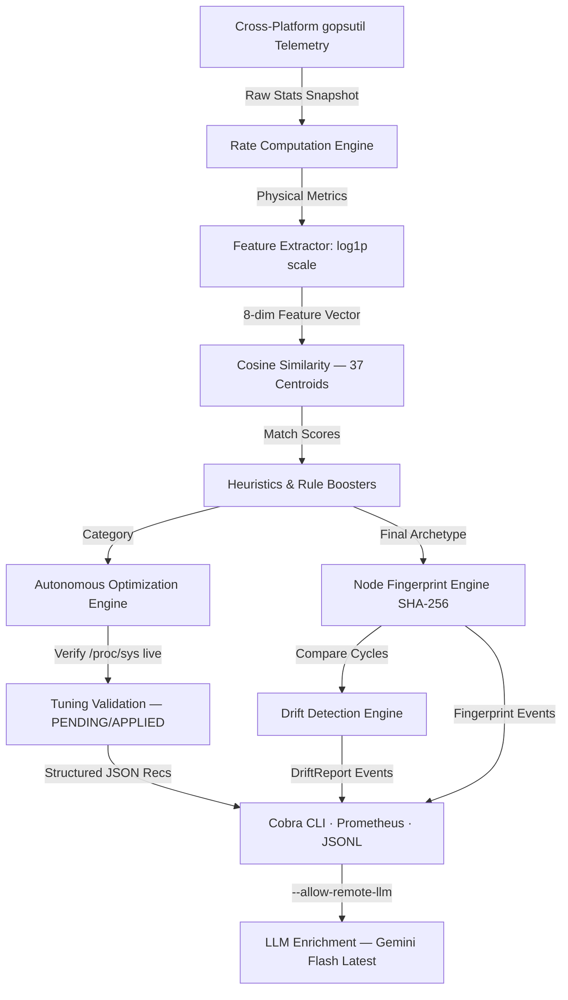

# ProcLens — Universal Process Intelligence & Workload Classifier

<div align="center">

[](https://go.dev)
[](LICENSE)
[](how-to-run-this-repo.md)
[](terminologies.md#cap_sys_ptrace)

**Production-grade, zero-ML-dependency process intelligence in a single statically-linked Go binary.**

[Quick Start](#quick-start) · [Commands](#command-reference) · [Architecture](#system-architecture) · [How to Run](how-to-run-this-repo.md) · [Terminology Guide](terminologies.md) · [Contributing](CONTRIBUTING.md)

</div>

---

> **What ProcLens does in one sentence:**  
> It reads live `/proc` telemetry, classifies every running process into one of **37 semantic workload archetypes**, generates validated kernel tuning recommendations, detects architectural shifts on the node, and optionally sends a structured payload to a frontier LLM for SRE narrative analysis — all in a single binary with no root required.

---

## Table of Contents

- [Quick Start](#quick-start)
- [Why ProcLens? — Unique Selling Points](#why-proclens--unique-selling-points)
- [37 Workload Archetypes](#37-workload-archetypes)
- [System Architecture](#system-architecture)
- [Mathematical Model](#mathematical-classification-model)
- [Command Reference](#command-reference)
- [Colorful Terminal Output](#colorful-terminal-output)
- [LLM Enrichment (enrich)](#llm-enrichment-enrich)
- [Build & Deploy](#build--deploy)
- [Security Model](#security-model)
- [Prometheus Metrics](#prometheus-metrics)
- [Production Readiness Checklist](#production-readiness-checklist)
- [Testing & Quality](#testing--quality)
- [Comparison Matrix](#comparison-matrix)
- [Roadmap](#roadmap)
- [Related Docs](#related-docs)

---

## Quick Start

```bash
# Build on any platform
go build -o proc-lens ./cmd/proc-lens

# Scan all running processes (with colourful output)
./proc-lens scan

# Deep-dive a specific PID (Google-colour 256-colour report)
./proc-lens analyze --pid 1234

# AI-enriched SRE report using Gemini (latest Flash model)
export GEMINI_API_KEY="your-key"
./proc-lens enrich --allow-remote-llm

# Understand what a process is and why
./proc-lens explain --pid 1234

# Detect node workload drift from a scan log
./proc-lens drift --file scan.jsonl
```

> 📖 **New to the project?** Read [how-to-run-this-repo.md](how-to-run-this-repo.md) for a step-by-step guide, and [terminologies.md](terminologies.md) for plain-English explanations of every technical concept used here.

---

## Why ProcLens? — Unique Selling Points

No other lightweight edge agent combines all of the following in a single static binary:

### USP 1 — Semantic HLD Workload Classification (37 Archetypes, Zero ML, Sub-10µs)

Most monitoring tools tell you **how much** resource a process consumes. ProcLens tells you **what architectural role** that process plays.

Every running process is classified into one of **37 High-Level Design (HLD) archetypes** using a logarithmic cosine-similarity model combined with name/cmdline heuristic boosters. No Python, no TensorFlow, no ONNX — pure Go math in under 10 microseconds per process.

> 📖 See [terminologies.md → Cosine Similarity](terminologies.md#cosine-similarity), [log1p](terminologies.md#log1p), and [HLD Archetypes](terminologies.md#hld-archetypes-high-level-design-archetypes) for a detailed explanation of the algorithm.

**Why no other tool does this**: `node_exporter`, `Telegraf`, `osquery`, and `cAdvisor` give you raw counters. Parca and Falco give you deep profiling/security. None of them answer "is this process a database or a load balancer?" out of the box.

---

### USP 2 — Node Workload Fingerprint (Unique to ProcLens)

Every scan cycle, ProcLens computes a stable SHA-256 fingerprint of the node's workload category distribution.

```
[Node Fingerprint] 3a7f2c9b1e4d8f06...  |  Profile: RelationalDB (dominant) + CacheStore (heavy)  |  Diversity: 0.43
```

- Two nodes with the same workload mix produce the **same fingerprint** — enabling fleet-wide comparison without central coordination.
- A change in fingerprint signals a meaningful **architectural shift**, not just a metric spike.
- Emitted as structured JSONL (`event_type: "node_fingerprint"`) for Loki, Elasticsearch, Splunk.
- Includes a **Shannon entropy diversity score** [0.0–1.0].

> 📖 See [terminologies.md → SHA-256 Fingerprint](terminologies.md#sha-256-fingerprint) and [Shannon Entropy](terminologies.md#shannon-entropy--diversity-score).

---

### USP 3 — Workload Drift Detection (Unique to ProcLens)

When the workload mix changes significantly between scan cycles, ProcLens detects, classifies, and emits a structured drift event:

```json
{
  "event_type": "workload_drift",
  "severity": "CRITICAL",
  "max_delta_pct": 38.5,
  "summary": "AITraining workloads appeared on this node (now 38.5% of classified processes)",
  "changes": [
    {"category": "AITraining", "previous_pct": 0, "current_pct": 38.5, "direction": "appeared"},
    {"category": "UtilityBatch", "previous_pct": 45.0, "current_pct": 6.5, "direction": "decreased"}
  ]
}
```

> 📖 See [terminologies.md → Drift Detection](terminologies.md#drift-detection).

---

### USP 4 — Validated, Safe Kernel Optimization

ProcLens reads live kernel parameter values from `/proc/sys` and marks each recommendation as:

| Status | Meaning |
|---|---|
| `[ALREADY APPLIED]` | Kernel parameter already meets or exceeds the recommendation. |
| `[PENDING]` | Recommendation not yet applied — safe to act on. |
| `[NOT APPLICABLE]` | Does not apply to this platform (Windows/macOS). |

> 📖 See [terminologies.md → sysctl](terminologies.md#sysctl) and [Validated Kernel Optimization](terminologies.md#validated-kernel-optimization).

---

### USP 5 — Structured Machine-Readable Recommendations (GitOps-Friendly)

```json
{
  "key": "vm.dirty_background_ratio",
  "category": "RelationalDB",
  "recommended_command": "sysctl -w vm.dirty_background_ratio=5",
  "current_value": "20",
  "recommended_value": "5",
  "apply_status": "PENDING",
  "risk": "LOW",
  "confidence": "HIGH",
  "tags": ["kernel", "storage", "database", "io"]
}
```

Consumable by Ansible, Kyverno, OPA, or Kubernetes operators in a GitOps pipeline.

---

### USP 6 — Ultra-Low-Privilege Security Model

| Control | ProcLens | Typical eBPF Agent | Typical Commercial Agent |
|---|:---:|:---:|:---:|
| Runs as root | ❌ Never | ✅ Often | ✅ Often |
| Privileged container | ❌ Never | ✅ Often | ⚠️ Sometimes |
| Capabilities required | `CAP_SYS_PTRACE` only | `CAP_BPF` + `CAP_SYS_ADMIN` | Varies |
| Read-only root filesystem | ✅ Yes | ❌ Rarely | ❌ Rarely |
| Cmdline redaction | ✅ Default-on | ❌ No | ⚠️ Opt-in |
| Air-gap capable | ✅ Full local mode | ❌ Requires kernel headers | ❌ Requires cloud |

> 📖 See [terminologies.md → CAP_SYS_PTRACE](terminologies.md#cap_sys_ptrace).

---

### USP 7 — Platform Capability Transparency

```bash
./proc-lens capabilities
```

Honest, machine-readable report of exactly which features are FULL / PARTIAL / UNAVAILABLE on the current platform — the only edge agent that provides runtime self-description.

---

### USP 8 — True Dual-Use Binary

| Use Case | Command |
|---|---|
| Developer laptop (macOS/Windows) | `./proc-lens scan -c 0.1 -m 5.0` |
| Deep-dive a specific process | `./proc-lens analyze --pid 1234 --duration 2s` |
| Profile before deploying | `./proc-lens run --cmd "gunicorn app:main" --duration 5s` |
| AI-generated SRE report | `./proc-lens enrich --allow-remote-llm --top 5` |
| K8s DaemonSet (JSONL → Loki) | `./proc-lens scan --loop --format json` |
| CI pipeline workload check | `./proc-lens scan --format json \| jq '.primary_category'` |

> 📖 See [terminologies.md → Dual-Use (CLI + DaemonSet)](terminologies.md#dual-use-cli--daemonset).

---

### USP 9 — LLM Enrichment with Security Gates (Gemini Flash Latest)

The `enrich` subcommand sends a structured process telemetry payload to a frontier LLM for SRE narrative generation.

**Current default model**: `gemini-flash-latest` → resolves to **Gemini 2.5 Flash** (the latest stable GA).

**Security gates** (unique in this space):
- `--allow-remote-llm` is **mandatory** for non-local providers. No accidental data exfiltration.
- Local Ollama (`localhost`/`127.0.0.1`) works without the flag.
- API key transmitted via `X-goog-api-key` **header** (never in URL query params — avoids key leakage in proxy logs).
- Dedicated 120-second LLM context, independent of the signal-cancellation context — no more `context canceled` errors.
- Cmdline arguments are redacted **before** the payload is assembled.

---

### USP 10 — Google-Level 256-Colour Terminal Output

The `analyze` command renders a fully colourised, Google Material Design palette report:

```
╔══════════════════════════════════════════════════════════════════════════════╗
║       PROCLENS — PROCESS OBSERVABILITY & OPTIMIZATION REPORT                ║
╚══════════════════════════════════════════════════════════════════════════════╝

● Archetype Match Profile  (cosine similarity — top 8 of 37)

 ▶ InteractiveShell        [██████████████████████░░░░░░░░]  72.0%
   MessageBroker           [████████████████████░░░░░░░░░░]  68.0%
   LegacySOAService        [███████████████░░░░░░░░░░░░░░░]  54.0%
```

- **Bar fill colour** scales by score: 🟢 ≥70% · 🟡 40–69% · 🟠 20–39% · ⬜ <20%
- **Archetype tier colours** follow Google Material palette (Blue=Network, Green=Database, Red=AI, etc.)
- **Telemetry rows** colour-coded by threshold (green→yellow→red)

---

## 37 Workload Archetypes

The classifier now covers **37 archetypes** organised into 9 tiers, reflecting the modern reality of cloud-native, serverless, legacy SOA, and ML-ops workloads:

| Tier | Categories |
|---|---|
| **1 — Network Ingress** | `LoadBalancer` · `APIGateway` · `ServiceMesh` · `CDNEdgeNode` |
| **2 — Application** | `WebServer` · `Microservice` · `ServerlessWorker` · `JobWorker` · `SchedulerDaemon` |
| **3 — Data Stores** | `CacheStore` · `RelationalDB` · `NoSQLDB` · `ColumnarDB` · `VectorDB` · `TimeSeriesDB` · `GraphDB` · `ObjectStore` |
| **4 — Messaging** | `MessageBroker` · `EventStreaming` · `StreamProcessor` |
| **5 — Search/Analytics** | `SearchEngine` · `OLAPEngine` |
| **6 — AI/ML** | `AITraining` · `AIInference` · `MLPipeline` · `FeatureStore` |
| **7 — Infrastructure** | `OrchestratorAgent` · `OrchestratorPod` · `ServiceDiscovery` · `ConfigManager` |
| **8 — Observability** | `MonitoringAgent` · `LogAggregator` · `TracingAgent` |
| **9 — Developer/Legacy** | `InteractiveShell` · `UtilityBatch` · `LegacySOAService` · `CIRunner` · `Unknown` |

> **Examples per category** (selected):
>
> | Category | Real-world processes |
> |---|---|
> | `APIGateway` | Kong, Ambassador, APISIX, KrakenD |
> | `ServiceMesh` | Istio pilot-agent, Linkerd proxy, Consul connect |
> | `TimeSeriesDB` | InfluxDB, VictoriaMetrics, Prometheus TSDB |
> | `GraphDB` | Neo4j, JanusGraph, DGraph |
> | `ObjectStore` | MinIO, SeaweedFS, Ceph RGW |
> | `StreamProcessor` | Apache Flink, Spark Streaming, Kafka Streams |
> | `OLAPEngine` | Trino, Presto, Apache Druid, Spark SQL |
> | `MLPipeline` | MLflow, Kubeflow, DVC, Prefect |
> | `LogAggregator` | Fluent Bit, Fluentd, Logstash, Vector |
> | `TracingAgent` | Jaeger agent, Zipkin, OTel trace exporter |
> | `LegacySOAService` | JBoss, WebLogic, WebSphere, Tomcat |
> | `CIRunner` | GitHub Actions runner, GitLab CI runner, Jenkins agent |

---

## System Architecture



---

## Mathematical Classification Model

Raw telemetry values are first scaled logarithmically to normalise across wildly different ranges:

$$f(x) = \log_e(1 + x)$$

The cosine similarity between a process feature vector $\vec{P}$ and an archetype centroid $\vec{A}$:

$$\text{Similarity}(\vec{P}, \vec{A}) = \frac{\vec{P} \cdot \vec{A}}{\|\vec{P}\| \|\vec{A}\|}$$

The Shannon entropy diversity score for the node fingerprint:

$$H_{norm} = \frac{-\sum_{i} p_i \ln(p_i)}{\ln(N)}$$

where $p_i$ is the fraction of processes in category $i$ and $N$ is the number of distinct categories. `0.0` = single-archetype node; `1.0` = perfectly uniform mix.

> 📖 See [terminologies.md → Mathematics & Algorithms](terminologies.md#mathematics--algorithms) for beginner-friendly explanations of all these concepts.

---

## Command Reference

### `scan` — Fleet Node Intelligence

```bash
# Single-shot colourised table with node fingerprint header
./proc-lens scan -c 0.1 -m 5.0 -d 1s

# Loop mode with drift detection, PSI, and hardware profiling
./proc-lens scan --loop --interval 10s --enable-psi --enable-hardware-profile

# JSONL streaming for DaemonSet / log shipping
./proc-lens scan --loop --format json

# With Prometheus metrics endpoint
./proc-lens scan --loop --http-addr 0.0.0.0:8091
```

**Key flags:**

| Flag | Default | Description |
|---|---|---|
| `--duration / -d` | `1s` | Profiling window for rate calculations |
| `--min-cpu / -c` | `0.05` | Minimum CPU% to display |
| `--min-mem / -m` | `2.0` | Minimum RSS MB to display |
| `--loop / -l` | `false` | Continuous refresh mode |
| `--interval / -i` | `10s` | Refresh interval in loop mode |
| `--enable-psi` | `false` | Collect Linux Pressure Stall Information |
| `--enable-hardware-profile` | `false` | Collect NUMA / storage / SIMD topology |
| `--http-addr` | `127.0.0.1:8091` | Prometheus + healthz endpoint |
| `--http-bearer-token` | `""` | Optional auth token for metrics endpoint |

---

### `analyze` — Deep Process Profile (Colourised)

```bash
# Rich 256-colour report with score bars and structured recommendations
./proc-lens analyze --pid 1234 --duration 2s

# Machine-readable JSON with full StructuredRecommendations array
./proc-lens analyze --pid 1234 --format json
```

The `analyze` output now renders:
- **Google Blue** banner header
- Per-metric **threshold colouring** (green → yellow → red)
- **Reversed-video badge** for the primary archetype
- **30-cell coloured score bars** per archetype (lime-green / amber / orange / grey by score tier)
- **⚡ Heuristics** section in Google Amber
- **→ Recommendations** in Bright Green

---

### `run` — Shift-Left Workload Profiling

```bash
# Profile a command before production deployment
./proc-lens run --cmd "gunicorn app:main --workers 4" --duration 5s

# CI/CD pipeline check
./proc-lens run --cmd "tar -czf backup.tar.gz /var/log" --format json | jq '.primary_category'
```

---

### `enrich` — LLM-Powered SRE Reports

```bash
# Profile live system → Gemini Flash Latest → SRE analysis
export GEMINI_API_KEY="your-gemini-key"
./proc-lens enrich --allow-remote-llm

# Override model (e.g. experimental or another provider)
./proc-lens enrich --allow-remote-llm --model gemini-2.0-flash

# Analyse a specific PID only
./proc-lens enrich --allow-remote-llm --pid 1234

# Local Ollama (no --allow-remote-llm required)
./proc-lens enrich --endpoint "http://localhost:11434/v1/chat/completions" --model "llama3"

# Claude (Anthropic)
export ANTHROPIC_API_KEY="your-key"
./proc-lens enrich --provider claude --allow-remote-llm

# GPT-4o-mini (OpenAI)
export OPENAI_API_KEY="your-key"
./proc-lens enrich --provider openai --allow-remote-llm

# Load telemetry from a previously exported JSON file
./proc-lens enrich --file scan-export.json --allow-remote-llm
```

**Default models per provider:**

| Provider | Default Model | Notes |
|---|---|---|
| `gemini` | `gemini-flash-latest` | Resolves to Gemini 2.5 Flash GA |
| `openai` | `gpt-4o-mini` | Cost-efficient GPT-4 class |
| `grok` | `grok-2` | xAI Grok via `api.x.ai` |
| `claude` | `claude-3-5-sonnet-20241022` | Anthropic Sonnet |

> ⚠️ **Important**: The API key is passed via `X-goog-api-key` **header** (not URL query param) to avoid key leakage in proxy/server logs. The LLM HTTP call uses a **dedicated 120-second context**, fully isolated from the signal-cancellation context — eliminating the `context canceled` error that affected prior versions.

---

### `explain` — Classifier Reasoning

```bash
# Human-readable "why was this process classified X?" report
./proc-lens explain --pid 1234

# JSON output for automation
./proc-lens explain --pid 1234 --format json
```

---

### `psi` — Node Resource Pressure

```bash
# View CPU, memory, and I/O pressure stall information
./proc-lens psi

# Note: requires Linux kernel ≥ 4.20 with PSI enabled
```

> 📖 See [terminologies.md → PSI](terminologies.md#psi-pressure-stall-information).

---

### `hardware` — Hardware Topology & ISA Discovery

```bash
# NUMA layout, block storage type, SIMD instruction sets
./proc-lens hardware

# JSON output
./proc-lens hardware --format json
```

> 📖 See [terminologies.md → NUMA](terminologies.md#numa).

---

### `drift` — Workload Composition Shift Detection

```bash
# Analyse a scan log file for drift events
./proc-lens drift --file scan.jsonl

# JSON output
./proc-lens drift --file scan.jsonl --format json
```

---

### `capabilities` — Platform Transparency

```bash
# See which features are FULL / PARTIAL / UNAVAILABLE on this platform
./proc-lens capabilities

# Machine-readable JSON
./proc-lens capabilities --format json
```

---

## Colorful Terminal Output

ProcLens uses a **Google Material 256-colour ANSI palette** across all text-mode commands. Colors are mapped by semantic meaning:

| Colour | Hex | Used for |
|---|---|---|
| Google Blue `38;5;33` | `#4285F4` | Headers, network/ingress archetypes |
| Google Green `38;5;40` | `#34A853` | Data stores, recommendations ✓ |
| Google Yellow `38;5;220` | `#FBBC05` | Search/analytics, mid-score bars |
| Google Red `38;5;196` | `#EA4335` | AI Training, critical CPU |
| Google Orange `38;5;208` | `#FF6D00` | Messaging/streaming, disk write |
| Google Teal `38;5;37` | `#00897B` | Context switches, service mesh |
| Google Indigo `38;5;63` | `#3949AB` | Orchestration / infrastructure |
| Google Pink `38;5;205` | `#E91E63` | AI inference / ML pipelines |
| Google Amber `38;5;214` | `#FF8F00` | Heuristics ⚡, observability |
| Google Gray `38;5;245` | `#9E9E9E` | Shell / utility / legacy |

Score bars fill with:
- 🟢 **Lime-green** `38;5;46` — score ≥ 70%
- 🟡 **Amber** `38;5;220` — score 40–69%
- 🟠 **Deep orange** `38;5;202` — score 20–39%
- ⬜ **Dark grey** `38;5;240` — score < 20%

---

## LLM Enrichment (enrich)

### What the LLM receives

A structured JSON payload containing:
- Node context: hostname, OS/arch, kernel version, CPU cores, total RAM
- Top-N process predictions with: PID, name, archetype, confidence, full telemetry (CPU user/system splits, RSS, swap, threads, FDs, sockets, I/O speeds, voluntary/involuntary context switches, OOM score, cgroup/container ID, pod UID)
- Local optimizer recommendations already computed

### What the LLM produces

A structured SRE report covering:
1. **Executive Summary** — one-paragraph node workload health assessment
2. **Workload Origin & Intent** — interprets process purpose from cmdlines + resource footprints
3. **System Risk Analysis** — identifies bottlenecks (CPU scheduler contention, OOM risk, I/O queues)
4. **Prioritized Optimization Plan** — actionable sysctl/ulimit commands with rationale, verification commands, and risk classification (Low / Medium / High)

### Security design

```
Signal ctx (Ctrl+C aware)     ──► profiling phase only
LLM ctx (120s, Background)   ──► callGemini() only
                                   │
                                   └─► X-goog-api-key header (never in URL)
```

---

## Build & Deploy

### Prerequisites

- Go 1.24+ installed
- For Linux cross-compile from Windows/macOS: set `CGO_ENABLED=0`

### Build Commands

```bash
# Linux (static binary — for Docker/K8s)
CGO_ENABLED=0 GOOS=linux GOARCH=amd64 go build -ldflags="-s -w -extldflags -static" -o proc-lens ./cmd/proc-lens

# macOS Apple Silicon
GOOS=darwin GOARCH=arm64 go build -o proc-lens-mac-silicon ./cmd/proc-lens

# macOS Intel
GOOS=darwin GOARCH=amd64 go build -o proc-lens-mac-intel ./cmd/proc-lens

# Windows
GOOS=windows GOARCH=amd64 go build -o proc-lens.exe ./cmd/proc-lens
```

> 📖 For a full walkthrough including environment setup and troubleshooting, see [how-to-run-this-repo.md](how-to-run-this-repo.md).

### Docker

```bash
# Build
docker build -t proc-lens:latest .

# Run (requires hostPID + CAP_SYS_PTRACE for host metrics)
docker run -d --name proc-lens \
  --pid=host --cap-add=SYS_PTRACE \
  -v /proc:/host/proc:ro -v /sys:/host/sys:ro \
  -e HOST_PROC=/host/proc -e HOST_SYS=/host/sys \
  proc-lens:latest
```

> 📖 See [terminologies.md → DaemonSet](terminologies.md#daemonset) for Kubernetes concepts.

### Kubernetes / Helm

```bash
# Validate templates
helm lint deploy/proc-lens

# Deploy as DaemonSet to kube-system
helm upgrade --install proc-lens deploy/proc-lens --namespace kube-system
```

The Helm chart ships with:
- UID 65534 (`nobody`), `privileged: false`, `readOnlyRootFilesystem: true`
- Only `CAP_SYS_PTRACE` added
- `/healthz` liveness/readiness probe on port `8091`
- `NetworkPolicy` restricting metrics scraping to authorised namespaces
- `PodDisruptionBudget` for safe rolling updates

### GoReleaser (CI/CD)

The release pipeline uses GoReleaser v2 (fully migrated — no deprecated fields):

| Old (deprecated) | New (v2) |
|---|---|
| `archives.format` | `archives.formats` |
| `dockers:` | `dockers_v2:` |
| `docker_manifests:` | `docker_manifests_v2:` |

```bash
# Local snapshot build (no tag required)
goreleaser release --snapshot --clean
```

> 📖 See [terminologies.md → GoReleaser](terminologies.md#goreleaser) and [terminologies.md → GHCR](terminologies.md#ghcr-github-container-registry).

---

## Security Model

ProcLens is designed with robust security controls:

1. **Least-Privilege Container**: Runs as `nobody` (UID 65534), `allowPrivilegeEscalation: false`, read-only root filesystem, only `CAP_SYS_PTRACE`.
2. **Command-Line Redaction**: Default-on — shows only the binary path + `[REDACTED]`. Use `--expose-cmdline` deliberately.
3. **Subprocess Execution Guard**: `run` subcommand requires explicit `--allow-run`. Blocked entirely in host-privileged container context (UID 0 + `HOST_PROC`).
4. **Outbound Exfiltration Gate**: `enrich` requires `--allow-remote-llm` for non-local LLM endpoints. Blocked in host-privileged container context.
5. **Secure Metrics Server**: Optional Bearer token auth (`--http-bearer-token`), `ReadTimeout`/`WriteTimeout`/`MaxHeaderBytes` hardening, `NetworkPolicy` in Helm chart.
6. **API Key Safety**: Gemini API key sent via `X-goog-api-key` header — never in URL query params.

For a detailed competitive landscape comparison, see [COMPETITIVE-LANDSCAPE.md](COMPETITIVE-LANDSCAPE.md).

---

## Prometheus Metrics

ProcLens exports **low-cardinality** Prometheus metrics on `/metrics` (port `8091` by default). Labels use category strings only — no per-PID labels that would cause cardinality explosion.

| Metric | Type | Description |
|---|---|---|
| `proc_lens_scans_total` | Counter | Scan cycles completed |
| `proc_lens_collection_errors_total` | Counter | Errors by reason label |
| `proc_lens_processes_classified_total` | Counter | Cumulative classifications by category |
| `proc_lens_processes_scanned` | Gauge | PIDs discovered in last cycle |
| `proc_lens_predictions` | Gauge | Current counts by category |
| `proc_lens_agent_cpu_usage_percent` | Gauge | Agent's own CPU usage |
| `proc_lens_agent_memory_rss_bytes` | Gauge | Agent's own RSS |
| `proc_lens_k8s_metadata_success_rate` | Gauge | Pod metadata resolution rate |
| `proc_lens_collection_duration_seconds` | Histogram | Full cycle duration |
| `proc_lens_per_process_collection_seconds` | Histogram | Per-PID collection cost |
| `proc_lens_http_requests_total` | Counter | HTTP requests to metrics/healthz server |

**FinOps use case**: Feed `proc_lens_predictions{category="RelationalDB"}` into OpenCost or Kubecost to explain why certain nodes have high IOPS costs.

> 📖 See [terminologies.md → Low-Cardinality Metrics](terminologies.md#low-cardinality-metrics) and [JSONL Output](terminologies.md#jsonl-output).

---

## Production Readiness Checklist

Before deploying ProcLens in production:

- [ ] **Least Privilege** — container runs with `readOnlyRootFilesystem: true`, only `CAP_SYS_PTRACE`, `allowPrivilegeEscalation: false`
- [ ] **HTTP Server Hardening** — if exposing `/metrics`, configure `--http-bearer-token`
- [ ] **Network Segmentation** — enable the default `NetworkPolicy` to restrict port `8091` to Prometheus pods only
- [ ] **Resource Limits** — set CPU limit (e.g. `200m`) and memory limit (e.g. `256Mi`) on the DaemonSet
- [ ] **Host Namespace Mapping** — `HOST_PROC=/host/proc` and `HOST_SYS=/host/sys` correctly set and read-only mounted
- [ ] **Cmdline Redaction** — confirm `--expose-cmdline` is NOT set unless explicitly required
- [ ] **LLM Gate** — if using `enrich`, confirm `--allow-remote-llm` intent and firewall rules
- [ ] **GoReleaser v2** — `.goreleaser.yml` uses `dockers_v2` / `docker_manifests_v2` (no deprecated fields)

---

## Testing & Quality

```bash
# Run the full test suite
go test ./... -v -count=1

# Run only classifier tests (includes all 37 archetype table tests)
go test ./pkg/classifier/... -v

# Benchmarks
go test ./pkg/classifier -bench=. -run=^$

# Fuzz testing (requires Go 1.21+)
go test ./pkg/classifier -fuzz=FuzzPredict -fuzztime=30s

# Verify build for all platforms
go build ./...
```

The test suite includes:
- **Table-driven tests** for all 37 archetypes (including Kafka, Kong, Istio, InfluxDB, MinIO, Fluent Bit, etcd, Celery, JBoss, GitHub Actions runner, Neo4j, Triton)
- **Zero-value safety** — `Predict(collector.ProcessStats{})` must never panic
- **Confidence bounds** — all outputs guaranteed in `[0.0, 1.0]`
- **Centroid completeness** — every category constant must have a matching centroid entry
- **Fuzz harness** — property-based testing with arbitrary name/cmdline inputs

---

## Comparison Matrix

| Feature | ProcLens | node_exporter | Parca | Falco | Tetragon | Coroot | osquery | Telegraf |
|---|:---:|:---:|:---:|:---:|:---:|:---:|:---:|:---:|
| **HLD Semantic Classification** | ✅ 37 archetypes | ❌ | ❌ | ❌ | ❌ | ⚠️ Partial | ❌ | ❌ |
| **Node Workload Fingerprint** | ✅ SHA-256 | ❌ | ❌ | ❌ | ❌ | ❌ | ❌ | ❌ |
| **Workload Drift Detection** | ✅ Structured events | ❌ | ❌ | ⚠️ Rule-based | ⚠️ Rule-based | ❌ | ❌ | ❌ |
| **Validated Kernel Tuning** | ✅ Live /proc/sys | ❌ | ❌ | ❌ | ❌ | ❌ | ❌ | ❌ |
| **Machine-Readable Recommendations** | ✅ JSON + Risk | ❌ | ❌ | ❌ | ❌ | ❌ | ❌ | ❌ |
| **Cmdline Redaction (Default)** | ✅ | ❌ | ❌ | ❌ | ❌ | ❌ | ❌ | ❌ |
| **Air-Gap Capable** | ✅ | ✅ | ✅ | ⚠️ | ⚠️ | ❌ | ✅ | ✅ |
| **Capabilities Required** | `PTRACE` only | None | `BPF` etc | `BPF`/module | `BPF`/module | `BPF` etc | None | None |
| **LLM Enrichment (Gated)** | ✅ Gemini/GPT/Claude | ❌ | ❌ | ❌ | ❌ | ⚠️ Backend | ❌ | ❌ |
| **256-Colour CLI Output** | ✅ Google palette | ❌ | ❌ | ❌ | ❌ | ❌ | ❌ | ❌ |
| **Platform Capability Report** | ✅ | ❌ | ❌ | ❌ | ❌ | ❌ | ❌ | ❌ |
| **Self-Observing Metrics** | ✅ 11 metrics | ✅ | ❌ | ❌ | ❌ | ✅ | ❌ | ✅ |
| **Static Single Binary** | ✅ | ✅ | ❌ | ❌ | ❌ | ❌ | ⚠️ | ✅ |
| **Windows Support** | ✅ Graceful | ✅ win_exporter | ❌ | ❌ | ❌ | ❌ | ✅ | ✅ |

---

## Roadmap

- **Centralized Intellect Service** — decouple LLM calling from the edge collector for tighter security
- **Kubernetes Downward API** — correlate processes with Deployment/StatefulSet owners and QoS classes
- **Temporal Trend Buffers** — rolling 5-minute history for memory leak / CPU ramp detection
- **Fingerprint-keyed LLM Cache** — cache enrichment results by fingerprint hash to reduce API costs
- **GitOps Recommendation Export** — `--dry-run-json` flag outputting Ansible/Terraform-compatible format
- **eBPF Classifier Accelerator** — optional eBPF probe for sub-microsecond feature extraction
- **WASM Plugin System** — user-defined archetype rules without recompiling

---

## Related Docs

| Document | Description |
|---|---|
| [terminologies.md](terminologies.md) | Plain-English glossary of every technical concept — ideal for junior engineers and newcomers |
| [how-to-run-this-repo.md](how-to-run-this-repo.md) | Step-by-step environment setup, build instructions, and troubleshooting guide |
| [CONTRIBUTING.md](CONTRIBUTING.md) | How to contribute, branch conventions, PR process, and code standards |
| [COMPETITIVE-LANDSCAPE.md](COMPETITIVE-LANDSCAPE.md) | Detailed comparison against Falco, Tetragon, osquery, Parca, Coroot, and others |
| [CHANGELOG.md](CHANGELOG.md) | Release history and version notes |
| [CODE_OF_CONDUCT.md](CODE_OF_CONDUCT.md) | Community standards and reporting guidelines |

---

<div align="center">

**ProcLens** — _See what your processes really are._

Built with ❤️ in Go · Apache 2.0 · [Contribute](CONTRIBUTING.md) · [Report an Issue](https://github.com/developer1622/proc-lens/issues)

</div>
